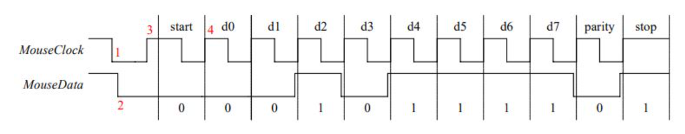

# SUSTech_CS202_NaiveCPU

源码托管于 GitHub，访问链接：
https://github.com/OptimistiCompound/SUSTech_CS202_NaiveCPU

## CPU特性

### 1. ISA

| Inst Name | FMT | Opcode  | funct3 | funct7 | Description                          |
| --------- | --- | ------- | ------ | ------ | ------------------------------------ |
| add       | R   | 0110011 | 0x0    | 0x00   | rd = rs1 + rs2                       |
| sub       | R   | 0110011 | 0x0    | 0x20   | rd = rs1 - rs2                       |
| xor       | R   | 0110011 | 0x4    | 0x00   | rd = rs1 ^ rs2                       |
| or        | R   | 0110011 | 0x6    | 0x00   | rd = rs1 \| rs2                      |
| and       | R   | 0110011 | 0x7    | 0x00   | rd = rs1 & rs2                       |
| sll       | R   | 0110011 | 0x1    | 0x00   | rd = rs1 << rs2                      |
| srl       | R   | 0110011 | 0x5    | 0x00   | rd = rs1 >> rs2 (logical)            |
| sra       | R   | 0110011 | 0x5    | 0x20   | rd = rs1 >> rs2 (arithmetic)         |
| slt       | R   | 0110011 | 0x2    | 0x00   | rd = (rs1 < rs2) ? 1 : 0             |
| sltu      | R   | 0110011 | 0x3    | 0x00   | rd = (rs1 < rs2) ? 1 : 0 (unsigned)  |
| addi      | I   | 0010011 | 0x0    | -      | rd = rs1 + imm                       |
| xori      | I   | 0010011 | 0x4    | -      | rd = rs1 ^ imm                       |
| ori       | I   | 0010011 | 0x6    | -      | rd = rs1 \| imm                      |
| andi      | I   | 0010011 | 0x7    | -      | rd = rs1 & imm                       |
| slli      | I   | 0010011 | 0x1    | -      | rd = rs1 << imm[4:0]                 |
| srli      | I   | 0010011 | 0x5    | -      | rd = rs1 >> imm[4:0] (logical)       |
| srai      | I   | 0010011 | 0x5    | -      | rd = rs1 >> imm[4:0] (arithmetic)    |
| slti      | I   | 0010011 | 0x2    | -      | rd = (rs1 < imm) ? 1 : 0             |
| sltiu     | I   | 0010011 | 0x3    | -      | rd = (rs1 < imm) ? 1 : 0 (unsigned)  |
| lb        | I   | 0000011 | 0x0    | -      | rd = sign-ext(M[rs1+imm][7:0])       |
| lh        | I   | 0000011 | 0x1    | -      | rd = sign-ext(M[rs1+imm][15:0])      |
| lw        | I   | 0000011 | 0x2    | -      | rd = M[rs1+imm][31:0]                |
| lbu       | I   | 0000011 | 0x4    | -      | rd = zero-ext(M[rs1+imm][7:0])       |
| lhu       | I   | 0000011 | 0x5    | -      | rd = zero-ext(M[rs1+imm][15:0])      |
| sb        | S   | 0100011 | 0x0    | -      | M[rs1+imm][7:0] = rs2[7:0]           |
| sh        | S   | 0100011 | 0x1    | -      | M[rs1+imm][15:0] = rs2[15:0]         |
| sw        | S   | 0100011 | 0x2    | -      | M[rs1+imm][31:0] = rs2[31:0]         |
| beq       | B   | 1100011 | 0x0    | -      | if (rs1 == rs2) PC += imm            |
| bne       | B   | 1100011 | 0x1    | -      | if (rs1 != rs2) PC += imm            |
| blt       | B   | 1100011 | 0x4    | -      | if (rs1 < rs2) PC += imm             |
| bge       | B   | 1100011 | 0x5    | -      | if (rs1 >= rs2) PC += imm            |
| bltu      | B   | 1100011 | 0x6    | -      | if (rs1 < rs2) PC += imm (unsigned)  |
| bgeu      | B   | 1100011 | 0x7    | -      | if (rs1 >= rs2) PC += imm (unsigned) |
| jal       | J   | 1101111 | -      | -      | rd = PC+4; PC += imm                 |
| jalr      | I   | 1100111 | 0x0    | -      | rd = PC+4; PC = rs1 + imm            |
| lui       | U   | 0110111 | -      | -      | rd = imm << 12                       |
| auipc     | U   | 0010111 | -      | -      | rd = PC + (imm << 12)                |
| ecall     | I   | 1110011 | 0x0    | -      | 触发环境调用                               |
| ebreak    | I   | 1110011 | 0x0    | -      | 触发调试断点                               |

- 参考ISA：RISC-V
- 寻址空间：哈佛架构

### 2. CPU接口定义

|引脚|规格|名称|功能|
| ---- | ---- | ---- | ---- |
|T5|input|start_pg|接收uart数据|
|R15|input|conf_btn|数据输入确认按键|
|P17|input|clk|时钟引脚|
|P15|input|rstn_fpga|系统复位按键|
|U4|input|btn1|debug模式暂时解绑按键|
|V1|input|btn2|debug模式永久解绑按键|
|R17|input|btn3|debug模式主动进入按键|
|K5|input|ps2_clk|PS2 接口时钟引脚|
|L4|input|ps2_data|PS2 接口数据引脚|
|T3|input|base|数码管显示进制(0 for hex, 1 for dex)|
|N5|input|rx|UART 接收引脚|
|T4|output|tx|UART 发送引脚|
|V5|input|switch_d[8]|测试场景编号输入 0 位|
|V2|input|switch_d[9]|测试场景编号输入 1 位|
|U2|input|switch_d[10]|测试场景编号输入 2 位|
|U3|input|switch_d[11]|测试场景编号输入 3 位|
|R1|input|switch_d[0]|测试数据输入 0 位|
|N4|input|switch_d[1]|测试数据输入 1 位|
|M4|input|switch_d[2]|测试数据输入 2 位|
|R2|input|switch_d[3]|测试数据输入 3 位|
|P2|input|switch_d[4]|测试数据输入 4 位|
|P3|input|switch_d[5]|测试数据输入 5 位|
|P4|input|switch_d[6]|测试数据输入 6 位|
|P5|input|switch_d[7]|测试数据输入 7 位|
|G2|output|digit_en[7]|七段数码管位选引脚 7|
|C2|output|digit_en[6]|七段数码管位选引脚 6|
|C1|output|digit_en[5]|七段数码管位选引脚 5|
|H1|output|digit_en[4]|七段数码管位选引脚 4|
|G1|output|digit_en[3]|七段数码管位选引脚 3|
|F1|output|digit_en[2]|七段数码管位选引脚 2|
|E1|output|digit_en[1]|七段数码管位选引脚 1|
|G6|output|digit_en[0]|七段数码管位选引脚 0|
|D4|output|sseg[6]|七段数码管段选引脚 6|
|E3|output|sseg[5]|七段数码管段选引脚 5|
|D3|output|sseg[4]|七段数码管段选引脚 4|
|F4|output|sseg[3]|七段数码管段选引脚 3|
|F3|output|sseg[2]|七段数码管段选引脚 2|
|E2|output|sseg[1]|七段数码管段选引脚 1|
|D2|output|sseg[0]|七段数码管段选引脚 0|
|H2|output|sseg[7]|七段数码管段选引脚 7|
|B4|output|sseg1[6]|七段数码管段选引脚 6（另一组）|
|A4|output|sseg1[5]|七段数码管段选引脚 5（另一组）|
|A3|output|sseg1[4]|七段数码管段选引脚 4（另一组）|
|B1|output|sseg1[3]|七段数码管段选引脚 3（另一组）|
|A1|output|sseg1[2]|七段数码管段选引脚 2（另一组）|
|B3|output|sseg1[1]|七段数码管段选引脚 1（另一组）|
|B2|output|sseg1[0]|七段数码管段选引脚 0（另一组）|
|D5|output|sseg1[7]|七段数码管段选引脚 7（另一组）|
|K3|output|reg_LED[0]|LED指示灯引脚 0|
|M1|output|reg_LED[1]|LED指示灯引脚 1|
|L1|output|reg_LED[2]|LED指示灯引脚 2|
|K6|output|reg_LED[3]|LED指示灯引脚 3|
|J5|output|reg_LED[4]|LED指示灯引脚 4|
|H5|output|reg_LED[5]|LED指示灯引脚 5|
|H6|output|reg_LED[6]|LED指示灯引脚 6|
|K1|output|reg_LED[7]|LED指示灯引脚 7|
|K2|output|reg_LED[8]|LED指示灯引脚 8|
|J2|output|reg_LED[9]|LED指示灯引脚 9|
|J3|output|reg_LED[10]|LED指示灯引脚 10|
|H4|output|reg_LED[11]|LED指示灯引脚 11|
|J4|output|reg_LED[12]|LED指示灯引脚 12|
|G3|output|reg_LED[13]|LED指示灯引脚 13|
|G4|output|reg_LED[14]|LED指示灯引脚 14|
|F6|output|reg_LED[15]|LED指示灯引脚 15|


## 各模块端口定义

Controller

| Port                      | Description                         |
| --------------------      | ----------------------------------- |
| `input [31:0] inst`       | 32位指令输入                             |
| `input [31:0] ALUResult`  | ALU运算结果                               |
| `input zero`              | 分支跳转决定信号（1: 跳转）               |
| `output [1:0] ALUOp`      | 2位ALU操作码                            |
| `output ALUSrc`           | ALU操作数选择（0=寄存器ReadData2，1=立即数imm32） |
| `output MemRead`          | 内存读使能                               |
| `output MemWrite`         | 内存写使能                               |
| `output MemtoReg`         | 写回数据选择（0=ALU结果，1=内存数据）              |
| `output RegWrite`         | 寄存器写使能                              |
| `output ioRead`           | IO读使能                                  |
| `output ioWrite`          | IO写使能                                  |

IFetch

| Port                     | Description              |
|--------------------------|--------------------------|
| `input clk`              | 时钟信号                  |
| `input rst`              | 低电平有效复位信号           |
| `input [31:0] imm32`     | 扩展32位立即数            |
| `input Branch`           | 分支控制信号               |
| `input upg_rst_i`        | uart复位信号    |
| `input upg_clk_i`        | uart时钟信号         |
| `input upg_wen_i`        | uart写使能信号，高电平有效 |
| `input [14:0] upg_adr_i` | uart地址输入|
| `input [31:0] upg_dat_i` | uart数据输入|
| `input upg_done_i`       | uart当前命令输入完成       |
| `output [31:0] inst`     | 32位指令输出，送往译码阶段     |
| `output [31:0] pc4_i`    | 预计算的下一条指令地址（PC+4） |

Decoder

| Port                     | Description               |
| ------------------------ | ------------------------- |
| `input clk`              | 时钟信号输入，同步译码器操作            |
| `input rstn`             | 低电平有效复位信号                 |
| `input [31:0] ALUResult` | 来自ALU的32位运算结果             |
| `input [31:0] MemData`   | 来自数据存储器的32位读取数据           |
| `input [31:0] pc4_i`     | 当前指令地址+4的值                |
| `input regWrite`         | 寄存器写使能信号                  |
| `input MemtoReg`         | 回写数据选择信号（0=ALU结果，1=存储器数据） |
| `input [31:0] inst`      | 32位指令输入                   |
| `output [31:0] rdata1`   | rs1值                      |
| `output [31:0] rdata2`   | rs2值                      |
| `output [31:0] imm32`    | 扩展后32位立即数                 |


ALU

| Port                          | Description                                  |
| ----------------------------- | -------------------------------------------- |
| `input [31:0] ReadData1`      | 来自寄存器rs1的32位数据输入                             |
| `input [31:0] ReadData2`      | 来自寄存器rs2的32位数据输入                             |
| `input [31:0] imm32`          | 扩展后32位立即数                                    |
| `input ALUSrc`                | 多路选择器控制信号，决定第二个操作数来源（1: imm32, 0: ReadData2） |
| `input [1:0] ALUOp`           | 2位ALU操作控制信号                                  |
| `input [2:0] funct3`          | 来自指令的3位功能码                                   |
| `input [6:0] funct7`          | 来自指令的7位功能码                                   |
| `output reg [31:0] ALUResult` | 32位ALU运算结果输出                                 |
| `output zero`                 | 零标志位输出，用于分支指令判断（1: 要跳转）                     |


MemOrIO

| Port                     | Description                          |
|--------------------------|--------------------------------------|
| `input mRead`            | 读内存控制信号                        |
| `input mWrite`           | 写内存控制信号                        |
| `input ioRead`           | 读IO控制信号                         |
| `input ioWrite`          | 写IO控制信号                         |
| `input conf_btn_out`     | 读取自按键的信号                       |
| `input [31:0] addr_in`   | 读取自ALU的运算结果                       |
| `input [31:0] m_rdata`   | 读取自dMem的数据                     |
| `input [11:0] switch_data` | 读取自Switch的数据           |
| `input [3:0] key_data`   | 读取自Keyboard的数据          |
| `input [31:0] r_rdata`   | 读取自Reg的数据                      |
| `output [31:0] addr_out` | 输出地址，访问dMem                             |
| `output [31:0] r_wdata`  | 写回Reg的数据（Load）              |
| `output [31:0] write_data` | 写回Mem或者IO的数据（Store）                  |
| `output LEDCtrl`         | LED控制信号                         |
| `output SegCtrl`         | Seg控制信号                         |

DMem
|Port| Description|
|------ | ---------|
|`input clk`|时钟信号|
|`input MemRead`|读内存控制信号|
|`input MemWrite`|写内存控制信号|
|`input [14:0] addr`|读内存的地址|
|`input [31:0] din`|写内存的数据|
|`input upg_rst_i`|uart 复位信号|
|`input upg_clk_i`|uart 时钟信号|
|`input upg_wen_i`|uart 写使能信号|
|`input [13:0] upg_addr_i`|uart 输入内存的地址|
|`input [31:0] upg_data_i`|uart 输入内存的数据|
|`input [31:0] upg_done_i`|uart 写入完毕标识|
|`output [31:0] dout`|指令信息|

RegisterFile
|Port| Description|
|------ | ---------|
|`input clk`|时钟信号|
|`input rstn`|复位信号|
|`input [4:0] raddr1`|寄存器一地址|
|`input [4:0] raddr2`|寄存器二地址|
|`input [4:0] waddr`|目标寄存器地址|
|`input [31:0] wdata`|写入数据|
|`input regWrite`|寄存器写使能信号|
|`output [31:0] rdata1`|寄存器一值|
|`output [31:0] rdata2`|寄存器二值|

ImmGen
|Port| Description|
|------ | ---------|
|`input inst`|指令信息|
|`output [31:0] imm32`|经过拓展的立即数|

debounce
|Port| Description|
|------ | ---------|
|`input clk`|系统时钟|
|`input rstn`|复位信号|
|`input key_in`|输入键值|
|`output key_out`|消抖后键值|

clk_wiz

| Port     | Description                     |
| -------- | ------------------------------- |
| `input clk_in1`  | EGO1 的时钟信号，频率为 100MHz  |
| `output clk_out1` | 单周期时钟信号，频率为 23MHz    |
| `output clk_out2`| Uart 接口时钟信号，频率为 10MHz |

LED_con

| Port                        | Description |
| --------------------------- | ----------- |
| `input clk`                 | 时钟信号    |
| `input rstn`                | 复位信号    |
| `input base`                | 显示数字的进制|
| `input LEDCtrl`             | led显示控制信号|
| `input SegCtrl`             | 数码管显示控制信号|
| `input [31:0] write_data`   | 写入的显示数值|
| `output reg [15:0] reg_LED` | led显示信号|
| `output [7:0] digit_en`     |数码管位选信号 |
| `output [7:0] sseg`         |低位数码管段选信号|
| `output [7:0] sseg1`        |高位数码管段选信号|

seg

| Port                        | Description                      |
| --------------------------- | -------------------------------- |
| `input clk`                 | 时钟信号 |
| `input rstn`                | 复位信号|
| `input [31:0]data`          | 输入的即将显示的值 |
| `input base`                | 进制控制(0 for hex, 1 for dex)|
| `output reg [7:0] digit_en` | 数码管位选信号 |
| `output reg [7:0] sseg`     | 低位数码管段选信号|
| `output reg [7:0] sseg1`    | 高位数码管段选信号|

### 3. 对外设IO的支持
使用MMIO进行io，外设基地址如下，在汇编中采用轮询的方式进行访问。

|外设名称|基地址|
|-|-|
|`LED`|32'hFFFFFC60|
|`SWITCH`|32'hFFFFFC64|
|`KEY`|32'hFFFFFC68|
|`SEG`|32'hFFFFFC6C|
|`Btn`|32'hFFFFFC70|
|`KeyCtr`|32'hFFFFFC74|

## Bonus
### 键盘
keyboard_scan负责接受键盘输入的信号，实例化于keyboard_driver模块并且传递信号给该模块

|Port| Description|
|------ | ---------|
|`input clk`|系统时钟|
|`input rstn`|复位信号|
|`input ps2_clk`|键盘时钟|
|`input ps2_data`|键盘数据|
|`output [15:0] xkey`|连续键值|
|`output [21:0] data`|连续输入信号|
|`output data_in`|数据输入标识|

keyboard_driver负责将接收到的信号转换成五位的设定值并且输出，实例化于顶层模块并传递信号给Keyboard_cache模块

|Port| Description|
|------ | ---------|
|`input clk`|系统时钟|
|`input rstn`|复位信号|
|`input ps2_clk`|键盘时钟|
|`input ps2_data`|键盘数据|
|`output [4:0] data_out`|转化的键值|

Keyboard_cache键值缓存，负责将接受的值拼接起来，包括删除确认按键，实例化于顶层模块，将处理后的值作为键盘的input
|Port| Description|
|------ | ---------|
|`input clk`|系统时钟|
|`input rstn`|复位信号|
|`input [4:0] key_data`|输入的键值|
|`output [31:0] data_out`|经过拼接后的键盘输入|

#### 主要代码说明
`keyboard_scan`对 PS/2 时钟 (ps2_clk) 和数据 (ps2_data) 进行 8 级移位寄存器滤波，键被按下时的编码叫做通码(makecode)，弹起时的编码叫做断码(breakcode)，大部分键的通码和断码都是 8 位 1 字节，所以进行8 级移位寄存器滤波
当连续 8 个时钟周期检测到相同电平 (全 1 或全 0) 时，更新同步后的信号 ps2cf 和 ps2df
当时钟Clock的下降沿时，侦测到数据Data也拉低，代表一个数据包传送出来，之后的10个时钟下降沿，分别收到从最低位LSB到MSB的八位数据，1位的奇偶校验（1表示八位数据中1的位数为偶数，0是奇数），最后1位高电平表示数据包结束。

```
always @(posedge DIR or negedge rstn) begin
    if (!rstn) begin
        ps2c_filter <= 0;
        ps2d_filter <= 0;
        ps2cf <= 1;
        ps2df <= 1;
    end else begin
        ps2c_filter[7] <= ps2_clk;
        ps2c_filter[6:0] <= ps2c_filter[7:1];
        ps2d_filter[7] <= ps2_data;
        ps2d_filter[6:0] <= ps2d_filter[7:1];
        if (ps2c_filter == 8'b11111111)
            ps2cf <= 1;
        else if (ps2c_filter == 8'b00000000)
            ps2cf <= 0;
        if (ps2d_filter == 8'b11111111)
            ps2df <= 1;
        else if (ps2d_filter == 8'b00000000)
            ps2df <= 0;
    end
end

always @(negedge ps2cf or negedge rstn) begin
    if (!rstn) begin
        count <= 0;
    end else begin
        if (count >= 4'h10 && ps2df == 1'b1) begin
            count <= 0;
            data_in <= 1'b1;
        end else begin
            data_in <= 1'b0;
            count <= count + 1;
        end
    end
end
```
`xkey`作为连续两个键值有效值的拼接，只有八位的有效值，第一位是1位起始低电位，第十位是1位奇偶校验，第十一位是1位结尾高电位
`data`作为连续两个键盘信号的拼接
```
assign xkey = {shift2[8:1], shift1[8:1]};
assign data = {shift2, shift1};
```
`Keyboard_cache`
缓存将上一个状态的键值存入寄存器，当单间键值对应`enter`的时候就根据`key_data_valid`的值对输出数据进行更改
```
always @(posedge clk or negedge rstn) begin
    if (!rstn) begin
        data_out <= 32'h0; // 同步复位
    end
    else begin
        if (key_data == 5'b10000)begin
            case(key_data_valid)
                5'b10001: data_out <= {4'h0, data_out[31:4]}; 
                5'b10010: data_out <= 32'b0;
                5'b10000: begin end
                default: 
                    if (key_data_valid != 5'b11111) begin // 过滤无效键值
                        data_out <= {data_out[27:0], key_data_valid[3:0]}; // 左移4位并添加新数据
                    end
            endcase
        end
    end
end
always @(posedge clk or negedge rstn) begin
    if (!rstn) begin
        key_data_valid <= 5'b11111; // 同步复位
    end
    else begin
        key_data_valid <= key_data; 
    end
end
```

#### 使用说明
键值对应键盘上的`0-f`每次键值的输入由`enter`键确认输入，每次按下`enter`只能输入一位十六进制数字，删除单位数字`backspace`和清空缓存区`tab`都是需要`enter`确认的，最大接受八位十六进制数，发生溢出时高位会被舍弃，低位更新为最新的数字

https://blog.csdn.net/qimoDIY/article/details/99920981